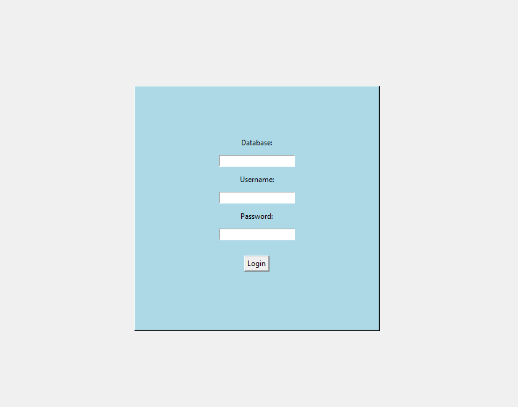
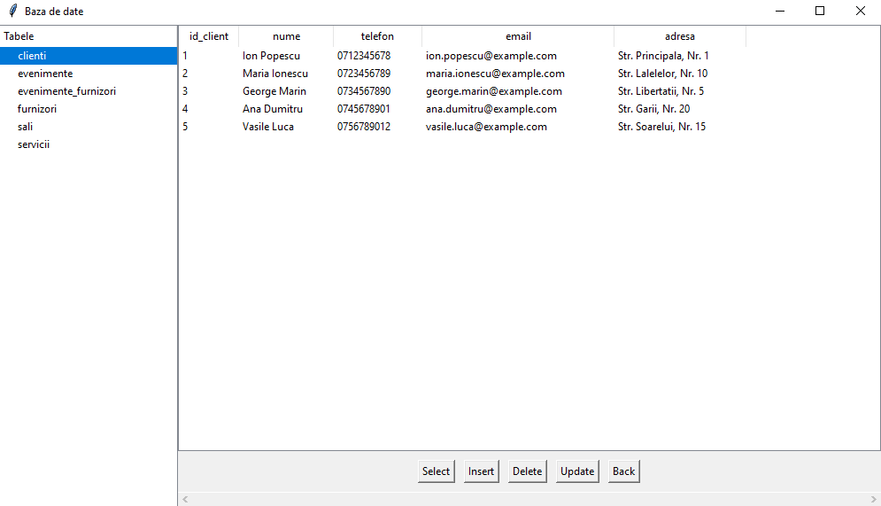

# Database Manager

## Overview

This project is a Python-based graphical user interface (GUI) for managing a MySQL database using Tkinter. The application provides a connection to a MySQL server, allowing users to retrieve and modify data conveniently. It features an authentication system to control access and supports key database operations.

## Features

- Connection to MySQL using `mysql.connector`
- User authentication system
- Support for CRUD operations:
  - **SELECT**: Retrieve data from the database
  - **INSERT**: Add new records
  - **UPDATE**: Modify existing records
  - **DELETE**: Remove records
- User-friendly Tkinter-based interface

## Project Structure

```
/
├── project.py        # Main application GUI and functionality
├── db_creator.py     # Script for creating the MySQL database and tables
├── README.md         # Project documentation
```

## Installation

### Prerequisites

Ensure you have the following installed on your system:

- Python 3.x
- MySQL Server
- Required Python libraries (`tkinter`, `mysql-connector-python`)

### Steps

1. Clone the repository:
2. Install dependencies:
3. Set up the database:
   - Ensure your MySQL server is running.
   - Run `db_creator.py` to create the database:
     ```sh
     python db_creator.py
     ```
4. Start the application:
   ```sh
   python project.py
   ```

## Usage

- Launch the application.
- Log in using your credentials.
- Perform database operations via the GUI.

## Screenshots

Here are some previews of the application:

### Login Screen


### Database Interface

   

